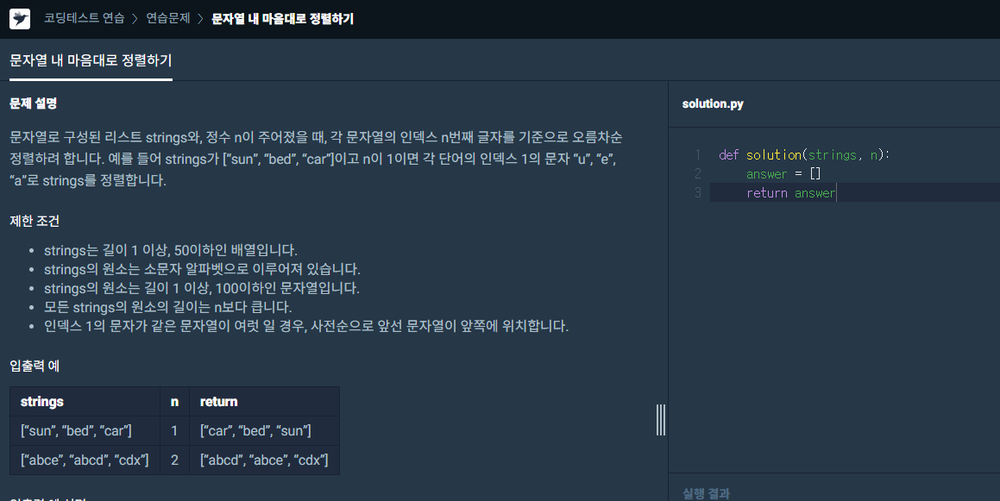

# Algorithm 문제 풀이

## 문제파싱 스크립트
### Programmers
```bash
py mkch_programmers.py --link <URL>
```

### example
- Challenge

문제 링크: [https://programmers.co.kr/learn/courses/30/lessons/12915?language=python3](https://programmers.co.kr/learn/courses/30/lessons/12915?language=python3)


- script command
```bash
py mkch_programmers.py --link https://programmers.co.kr/learn/courses/30/lessons/12915?language=python3
```

- result code
```python
#title: 문자열 내 마음대로 정렬하기.py
def solution(strings, n):
    answer = []
    return answer

strings = ['[sun, bed, car]', '[abce, abcd, cdx]']
n = [1, 2]

print(solution(strings[0], n[0]))
print(solution(strings[1], n[1]))

#case0: [car, bed, sun]
#case1: [abcd, abce, cdx]

```